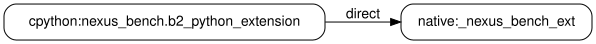
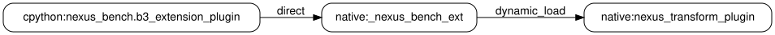
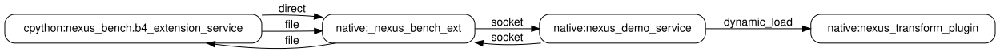

# NEXUS

NEXUS is a research prototype for discovering provenance-backed dependencies
that emerge when heterogeneous software components are composed. The prototype
factors analysis into runtime-domain attribution, shared interaction-mechanism
analysis, and runtime-independent dependency composition.

> **Prototype scope:** this repository is a runnable vertical slice. Boundary
> events are emitted through explicit adapter hooks; automatic whole-system
> capture and production runtime attribution are not implemented yet.

## Quick start

Requirements:

- Linux;
- CMake 3.20 or newer;
- a C++17 compiler;
- CPython 3.10 or newer with development headers;
- Graphviz (`dot`).

On Ubuntu, the required packages can be installed with:

```sh
sudo apt-get install cmake g++ graphviz python3-dev
```

Clone and run all four benchmarks:

```sh
git clone https://github.com/awen-li/NEXUS.git
cd NEXUS
./scripts/run-demo.sh
```

The command configures and builds the C++ components, runs each workload in an
isolated trace, analyzes the trace, checks the exact dependency oracle, and
generates JSON, DOT, and SVG graphs under `build/output/`.

## Benchmarks

The suite progresses from one local mechanism to cross-process composition.

| ID | Workload | Design | Mechanisms | Expected edges |
| --- | --- | --- | --- | ---: |
| B1 | `b1-python-file` | CPython producer -> file -> CPython consumer | file | 1 |
| B2 | `b2-python-extension` | CPython package -> in-process C++ extension | direct | 1 |
| B3 | `b3-extension-plugin` | CPython -> extension -> dynamically loaded C++ plugin | direct, dynamic load | 2 |
| B4 | `b4-extension-service` | CPython -> extension <-> C++ service -> plugin | direct, file, socket, dynamic load | 6 |

Together they emit 15 normalized interactions and recover 10 typed
dependencies. B1-B3 use one OS process; B4 correlates evidence across two.

### B1: Python Shared File


### B2: Python-Extension Direct Call



### B3: Extension-Plugin Dynamic Load



### B4: Extension-Service Round Trip



## Repository layout

```text
README.md
demo/                    NEXUS probe, adapters, analyzers, and graph composer
workloads/               named CPython/native benchmark cases and graph oracle
expected-output/         checked dependency sets and generated DOT/SVG graphs
scripts/                 one-command build, run, test, and regeneration helpers
```

## Design

The demo implements four layers:

1. `libnexus_probe.so` exposes a stable C event-emission ABI.
2. Runtime adapters attribute raw events to native, CPython, JVM, or fallback
   domains and normalize component identities.
3. Shared analyzers interpret direct calls, files, dynamic loading, sockets,
   and IPC without duplicating an analyzer for every runtime.
4. The dependency composer produces a typed graph retaining mechanism,
   canonical object, provenance, resolution, and process-qualified evidence.

The C ABI is the runtime-extension seam. Native code, the CPython extension,
and the standalone service use it in this release. A future JVM agent can use
the same seam through JNI while sharing the mechanism analyzers.

## Other commands

Build without running the workloads:

```sh
./scripts/build.sh
```

Run the CTest oracle:

```sh
./scripts/test.sh
```

Regenerate the checked files in `expected-output/` from fresh executions:

```sh
./scripts/generate-expected-output.sh
```

Set `NEXUS_BUILD_DIR` to use a non-default build directory. Set
`CMAKE_BUILD_TYPE` to select a configuration; the scripts default to `Debug`.

## Current limitations

- The probe API is called from explicit adapter hooks; automatic eBPF/user-probe
  collection is not included.
- The Unix-domain socket is OS-visible, but client and service adapters
  currently report its events explicitly.
- CPython frame/module attribution is represented by the adapter seam rather
  than collected automatically.
- A JVM normalization adapter exists, but this suite does not include a Java
  agent or JVM workload.
- File composition uses bounded last-writer-before-reader semantics; socket and
  IPC composition use bounded sender-before-receiver semantics.

NEXUS is therefore evidence for the factorized design and cross-process
composition path, not a claim of complete architecture recovery or
production-ready system capture.
